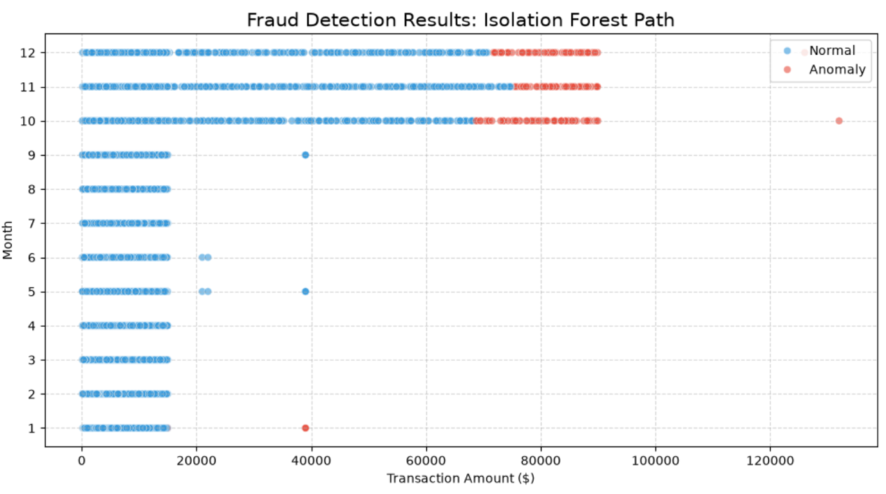
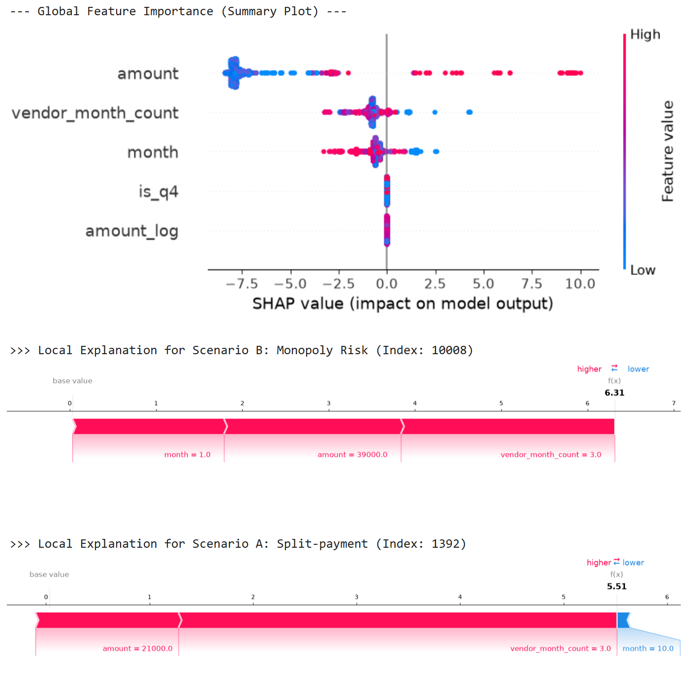
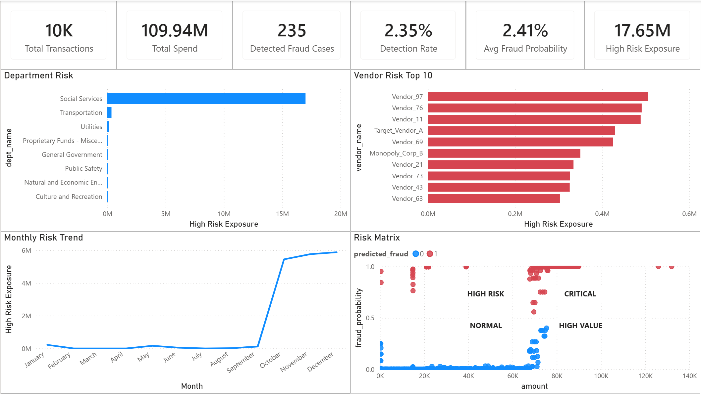

# Financial Risk Decision Intelligence System

> **Project Goal:** Build an end-to-end Financial Risk Decision Intelligence platform that integrates SQL-based audit analytics, machine learning, explainable AI, and executive business intelligence to support data-driven financial risk monitoring and investigation prioritization.
>> 🔗 **[Live Demo on Streamlit Cloud](https://financial-risk-decision-intelligence-system.streamlit.app)**

---

## 📖 Project Overview

This project demonstrates how financial risk analytics can be transformed into a **Decision Intelligence platform** by integrating rule-based auditing, machine learning, explainable AI, and executive business intelligence.

Inspired by real-world public sector budget management, the platform simulates an end-to-end financial risk monitoring workflow—from transaction analysis and fraud detection to executive risk reporting—supporting both operational investigators and financial decision-makers.

---

## 🛠️ Tech Stack

- **Language:** Python, SQL
- **Libraries:** Pandas, NumPy, Scikit-learn, Matplotlib
- **Database:** PostgreSQL
- **Machine Learning:** Isolation Forest, XGBoost
- **Explainable AI:** SHAP
- **Business Intelligence:** Power BI
- **Web Application:** Streamlit

---

## 🧱 System Architecture

```text
Financial Transactions
        ↓
SQL Audit Analytics (Rule-based Detection)
        ↓
Isolation Forest (Unsupervised Anomaly Detection)
        ↓
XGBoost (Supervised Fraud Prediction)
        ↓
SHAP Explainability (Model Interpretation)
        ↓
Power BI Executive Risk Dashboard
```

---

## 📊 Data Strategy

Rather than relying on publicly available datasets, this project uses a **synthetic financial transaction dataset** designed to simulate realistic public expenditure scenarios and fraud patterns.

The dataset enables controlled validation of audit rules and machine learning models by incorporating predefined behavioral risks such as:

- Tactical payment splitting
- Vendor concentration
- Fiscal year-end spending anomalies
- High-risk transaction patterns

This approach provides reliable ground-truth labels for supervised learning while creating realistic business scenarios for executive risk analysis.

---

## 🔍 Detection Methodology

The Financial Risk Decision Intelligence System combines deterministic audit analytics with machine learning and executive business intelligence to identify, explain, and monitor financial risks through a multi-layered analytical workflow.

---

### 1. SQL-Based Audit Analytics

Applies deterministic audit rules to identify known financial risk patterns before machine learning analysis.

**Key Insights**

- Identified tactical payment splitting using a 7-day rolling transaction window.
- Detected vendor concentration through annual spending and budget share thresholds.
- Flagged fiscal year-end spending anomalies that indicate elevated financial risk.
- Established a transparent rule-based baseline to complement machine learning predictions.

---

### 2. Isolation Forest



Uses unsupervised anomaly detection to identify previously unknown financial risk patterns without predefined fraud labels.

**Key Insights**

- Successfully detected high-risk outlier transactions based on abnormal behavioral patterns.
- Effectively identified extreme financial anomalies that traditional rule-based analytics may overlook.
- Revealed limitations caused by masking effects, where moderate-risk transactions blended into normal business behavior.
- Demonstrated the need for supervised learning to improve classification precision.

---

### 3. XGBoost + SHAP Explainability



Builds a supervised fraud prediction model and explains individual prediction results through SHAP.

**Key Insights**

- Engineered behavioral features capturing transaction frequency, spending patterns, and fiscal timing.
- Achieved high fraud detection performance with **98% Precision**, **98% Recall**, and a **0.99 F1-score**.
- SHAP global analysis identified the most influential risk factors driving fraud predictions.
- Local SHAP explanations provided transparent justification for individual high-risk transactions, improving model interpretability for financial investigations.

---

### 4. Executive Risk Dashboard



Transforms analytical outputs into executive-level financial risk intelligence through an integrated Power BI dashboard.

**Key Insights**

- Consolidated SQL audit results and machine learning risk scores into a unified executive monitoring dashboard.
- Enabled risk prioritization through fraud probability, financial exposure, and vendor concentration analysis.
- Visualized department-level risk distribution and monthly risk trends for portfolio-level monitoring.
- Supported data-driven investigation prioritization through integrated financial risk KPIs.

---

## 💼 Business Value

This project demonstrates how traditional financial risk analytics can evolve into a **Financial Risk Decision Intelligence platform** by integrating SQL-based audit analytics, machine learning, explainable AI, and executive business intelligence into a unified analytical workflow.

Rather than simply detecting suspicious transactions, the platform enables finance leaders to identify high-risk spending patterns, prioritize investigations, monitor organizational risk exposure, and support data-driven financial governance through transparent and explainable risk analytics.

By combining deterministic audit rules, behavioral anomaly detection, supervised fraud prediction, and executive dashboards, the system bridges operational fraud detection with strategic financial decision-making, illustrating how modern analytics can enhance financial oversight and risk management.
